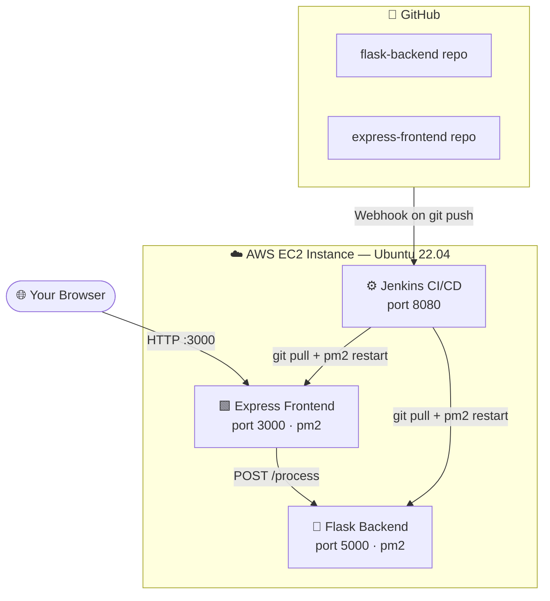
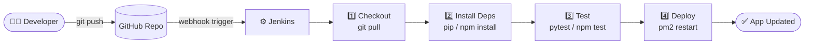

# CI/CD Deployment 

Deploy a Flask backend (port 5000) and Express frontend (port 3000) on a single EC2 instance with a Jenkins CI/CD pipeline.

---

## Architecture

### Project Overview



### CI/CD Pipeline Flow



### Security Group Inbound Rules

| Port | Protocol | Purpose |
|------|----------|---------|
| `22` | TCP | SSH access |
| `3000` | TCP | Express Frontend |
| `5000` | TCP | Flask Backend |
| `8080` | TCP | Jenkins UI |

---

## Local Development (VS Code)

Run both apps locally before deploying to EC2.

### Prerequisites

- [Python 3](https://www.python.org/downloads/) installed
- [Node.js](https://nodejs.org/) installed

### 1. Set Up Virtual Environments

**Flask — Python venv:**
```bash
cd flask-backend

# Create venv
python -m venv venv

# Activate (Windows)
venv\Scripts\activate

# Activate (Mac/Linux)
source venv/bin/activate

# Install dependencies
pip install -r requirements.txt
```

Your terminal prefix will show `(venv)` when the virtual environment is active.

> Re-run `venv\Scripts\activate` (Windows) or `source venv/bin/activate` (Mac/Linux) every time you open a new terminal for Flask.

**Express — Node.js (no venv needed):**

Node.js doesn't need a virtual environment — `npm install` installs dependencies locally inside `node_modules/`, which is already project-scoped.

```bash
cd express-frontend
npm install
```

### 2. Run Both Apps

Open **two terminals** in VS Code (`Ctrl+Shift+5` to split):

**Terminal 1 — Flask backend (with venv active):**
```bash
cd flask-backend

# Activate venv first
venv\Scripts\activate        # Windows
# source venv/bin/activate   # Mac/Linux

python app.py
```
Expected: `Running on http://0.0.0.0:5000`

**Terminal 2 — Express frontend:**
```bash
cd express-frontend
node app.js
```
Expected: `Express app listening on port 3000`

### 3. Test

Open `http://localhost:3000` in your browser, fill in the form, and submit.

Express forwards the form data to Flask at `http://localhost:5000/process` and displays the response.

Or test Flask directly:
```bash
curl -X POST http://localhost:5000/process \
  -H "Content-Type: application/json" \
  -d "{\"name\":\"John\",\"message\":\"Hello\"}"
```

### 4. Deactivate Flask venv

```bash
deactivate
```

### App Flow

```
Browser → Express :3000 (serves form)
              │
              │ POST /submit (form data)
              ▼
         Flask :5000 /process (processes & replies)
              │
              ▼
         Express returns Flask response to browser
```

---

## Part 1: EC2 Setup & Application Deployment

### 1. Launch EC2 Instance

- AMI: Ubuntu 22.04 LTS (free-tier: `t2.micro`)
- Open inbound ports: `22`, `3000`, `5000`, `8080`
- Download the `.pem` key pair

### 2. SSH into the Instance

```bash
chmod 400 your-key.pem
ssh -i your-key.pem ubuntu@<EC2_PUBLIC_IP>
```

### 3. Install Dependencies

```bash
sudo apt update && sudo apt upgrade -y

# Python
sudo apt install -y python3 python3-pip python3-venv

# Node.js
curl -fsSL https://deb.nodesource.com/setup_20.x | sudo -E bash -
sudo apt install -y nodejs

# pm2 & Git
sudo npm install -g pm2
sudo apt install -y git
```

### 4. Deploy Flask Backend

```bash
git clone https://github.com/<your-username>/flask-backend.git
cd flask-backend
python3 -m venv venv
source venv/bin/activate
pip install -r requirements.txt
deactivate

pm2 start venv/bin/python --name flask-backend -- app.py
pm2 save
```

Verify: `curl http://<EC2_PUBLIC_IP>:5000/`

### 5. Deploy Express Frontend

```bash
cd ~
git clone https://github.com/<your-username>/express-frontend.git
cd express-frontend
npm install

pm2 start app.js --name express-frontend
pm2 save
```

Verify: `curl http://<EC2_PUBLIC_IP>:3000/`

### 6. Persist pm2 on Reboot

```bash
pm2 startup
# Run the command pm2 outputs, then:
pm2 save
```

---

## Part 2: Jenkins CI/CD Pipeline

> **What is CI/CD?**
> CI/CD stands for Continuous Integration / Continuous Deployment. Instead of manually SSHing into your server and restarting apps every time you push code, Jenkins watches your GitHub repo and does it automatically. Every `git push` triggers Jenkins to pull the latest code, install dependencies, run tests, and restart the app.

---

### Step 1: Install Jenkins on EC2

SSH into your EC2 instance and run the following commands one by one:

```bash
# Add Jenkins GPG key so apt trusts the Jenkins package
sudo wget -O /usr/share/keyrings/jenkins-keyring.asc \
  https://pkg.jenkins.io/debian-stable/jenkins.io-2026.key

# Add Jenkins to apt sources list
echo "deb [signed-by=/usr/share/keyrings/jenkins-keyring.asc] \
  https://pkg.jenkins.io/debian-stable binary/" | sudo tee \
  /etc/apt/sources.list.d/jenkins.list > /dev/null

# Update apt and install Jenkins + Java (Jenkins requires Java to run)
sudo apt update
sudo apt install -y jenkins openjdk-17-jdk

# Start Jenkins and enable it to auto-start on reboot
sudo systemctl enable --now jenkins
```

Verify Jenkins is running:
```bash
sudo systemctl status jenkins
# You should see: Active: active (running)
```

---

### Step 2: Unlock Jenkins in the Browser

1. Open your browser and go to `http://<EC2_PUBLIC_IP>:8080`
2. You will see an **Unlock Jenkins** screen asking for an initial admin password
3. Get the password from your EC2 terminal:

```bash
sudo cat /var/lib/jenkins/secrets/initialAdminPassword
```

4. Copy the output and paste it into the browser
5. Click **Continue**

---

### Step 3: Install Plugins

After unlocking, Jenkins will ask you to install plugins:

1. Click **Install suggested plugins** — wait for it to finish (takes 1-2 minutes)
2. Once done, create your **admin username and password** when prompted
3. Click **Save and Finish → Start using Jenkins**

Now install additional required plugins:

1. Go to **Manage Jenkins** (left sidebar) → **Plugins**
2. Click the **Available plugins** tab
3. Search and install each of these (tick the checkbox, then click **Install**):
   - `Git`
   - `NodeJS`
   - `Pipeline`
4. Tick **Restart Jenkins when installation is complete**

---

### Step 4: Configure NodeJS Tool

Jenkins needs to know where Node.js is for the Express pipeline:

1. Go to **Manage Jenkins → Tools**
2. Scroll down to **NodeJS installations** → click **Add NodeJS**
3. Fill in:
   - Name: `NodeJS20`
   - Version: `20.x` (select from dropdown)
4. Click **Save**

---

### Step 5: Allow Jenkins to Use pm2

By default, Jenkins runs as its own system user (`jenkins`) and cannot run `pm2` commands which are owned by the `ubuntu` user. Fix this:

```bash
# Add jenkins user to the ubuntu group
sudo usermod -aG ubuntu jenkins
```

Now give Jenkins permission to run pm2 without a password prompt:

```bash
# Open the sudoers file safely
sudo visudo
```

Scroll to the bottom of the file and add this line:

```
jenkins ALL=(ALL) NOPASSWD: /usr/bin/pm2
```

Save and exit (`Ctrl+X` → `Y` → `Enter` if using nano).

Restart Jenkins to apply the group change:
```bash
sudo systemctl restart jenkins
```

---

### Step 6: Create a Pipeline for Flask Backend

This creates a Jenkins job that watches your `flask-backend` GitHub repo.

1. On the Jenkins dashboard, click **New Item**
2. Enter name: `flask-backend`
3. Select **Pipeline** → click **OK**
4. On the configuration page:
   - Scroll to **Build Triggers** → tick **GitHub hook trigger for GITScm polling**
   - Scroll to **Pipeline** section
   - Set **Definition** to `Pipeline script from SCM`
   - Set **SCM** to `Git`
   - Enter your repo URL: `https://github.com/<your-username>/flask-backend.git`
   - Set **Branch** to `*/main`
   - Set **Script Path** to `Jenkinsfile`
5. Click **Save**

---

### Step 7: Create a Pipeline for Express Frontend

Repeat the same steps as above for the Express app:

1. Click **New Item**
2. Enter name: `express-frontend`
3. Select **Pipeline** → click **OK**
4. Same configuration as Flask but with your `express-frontend` repo URL
5. Click **Save**

---

### Step 8: Set Up GitHub Webhook

A webhook tells GitHub to notify Jenkins every time you push code, so the pipeline runs automatically.

**In your GitHub repository:**

1. Go to your repo → **Settings** tab
2. Click **Webhooks** in the left sidebar → **Add webhook**
3. Fill in:
   - **Payload URL**: `http://<EC2_PUBLIC_IP>:8080/github-webhook/`
   - **Content type**: `application/json`
   - **Which events**: select `Just the push event`
4. Click **Add webhook**
5. GitHub will send a test ping — you should see a green tick ✅ next to the webhook

> Repeat this for both repos (flask-backend and express-frontend).

---

### Step 9: Test the Pipeline

Trigger a build manually first to make sure everything works:

1. Go to your Jenkins dashboard
2. Click on `flask-backend` job → click **Build Now** (left sidebar)
3. Click on the build number (e.g. `#1`) under **Build History**
4. Click **Console Output** to watch the live logs

You should see each stage complete:
```
[Checkout]              ✔
[Install Dependencies]  ✔
[Test]                  ✔
[Deploy]                ✔

Finished: SUCCESS
```

Repeat for `express-frontend`.

Now try the full automation — make a small change to your code, push to GitHub, and watch Jenkins trigger automatically within seconds.

---

## Screenshots

> Add your screenshots inside the `screenshots/` folder using the filenames below. They will render here automatically.

### Part 1 — EC2 & App Deployment

#### 1. EC2 Instance Running
> AWS Console → EC2 → Instances → Instance State: **Running**


---

#### 2. Security Group Inbound Rules
> AWS Console → EC2 → Security Groups → Inbound rules showing ports `22`, `3000`, `5000`, `8080`


---

#### 3. SSH Connected to EC2
> Your terminal showing `ubuntu@ip-...` after SSH login


---

#### 4. pm2 List — Both Apps Online
> Run `pm2 list` in EC2 terminal — both `flask-backend` and `express-frontend` should show **online**


---

#### 5. Flask Response in Browser
> Open `http://<EC2_PUBLIC_IP>:5000/` in browser


---

#### 6. Express Form in Browser
> Open `http://<EC2_PUBLIC_IP>:3000/` in browser


---

#### 7. Form Submitted — Flask Response Displayed
> Fill in the form and submit — Flask response should appear on screen


---

### Part 2 — Jenkins CI/CD Pipeline

#### 8. Jenkins Dashboard — Both Pipeline Jobs
> Open `http://<EC2_PUBLIC_IP>:8080` — both `flask-backend` and `express-frontend` jobs visible


---

#### 9. Flask Backend Pipeline — All Stages Green
> Jenkins → flask-backend job → Stage View showing all 4 stages passed ✅


---

#### 10. Express Frontend Pipeline — All Stages Green
> Jenkins → express-frontend job → Stage View showing all 4 stages passed ✅


---

#### 11. Console Output — Finished: SUCCESS
> Jenkins → any build → Console Output → scroll to bottom showing `Finished: SUCCESS`


---

#### 12. GitHub Webhook — Green Tick
> GitHub → Repo Settings → Webhooks → green tick ✅ showing successful delivery


---

#### 13. Auto-Triggered Build After git push
> Make a small code change → `git push` → Jenkins auto-triggers build within seconds
> Capture the build timestamp matching your push time


---

## Pipeline Flow

```
GitHub Push
    │
    ▼
Jenkins Webhook Trigger
    │
    ├── Checkout           (git pull latest code)
    ├── Install Dependencies (pip install / npm install)
    ├── Test               (pytest / npm test)
    └── Deploy             (pm2 restart)
```

---

## Repository Structure

```
flask-backend/
├── app.py
├── requirements.txt
└── Jenkinsfile

express-frontend/
├── app.js
├── package.json
└── Jenkinsfile
```

---

## Verification

| Service  | URL                              |
|----------|----------------------------------|
| Flask    | `http://<EC2_PUBLIC_IP>:5000/`   |
| Express  | `http://<EC2_PUBLIC_IP>:3000/`   |
| Jenkins  | `http://<EC2_PUBLIC_IP>:8080/`   |

Check running processes: `pm2 list`

---

## Troubleshooting

### ❌ Jenkins GPG Key Error

**Error:**
```
W: GPG error: https://pkg.jenkins.io/debian-stable binary/ Release:
   The following signatures couldn't be verified because the public key
   is not available: NO_PUBKEY 7198F4B714ABFC68
E: The repository 'https://pkg.jenkins.io/debian-stable binary/ Release' is not signed.
```

**Cause:** The old key URL `jenkins.io-2023.key` is expired/invalid. Jenkins updated their GPG key.

**Fix:** Use the updated `jenkins.io-2026.key` URL:

```bash
# Step 1: Remove old broken key and repo entry
sudo rm -f /usr/share/keyrings/jenkins-keyring.asc
sudo rm -f /etc/apt/sources.list.d/jenkins.list

# Step 2: Download the updated key
sudo wget -O /usr/share/keyrings/jenkins-keyring.asc \
  https://pkg.jenkins.io/debian-stable/jenkins.io-2026.key

# Step 3: Add the Jenkins repository
echo "deb [signed-by=/usr/share/keyrings/jenkins-keyring.asc] \
  https://pkg.jenkins.io/debian-stable binary/" | sudo tee \
  /etc/apt/sources.list.d/jenkins.list > /dev/null

# Step 4: Update and install
sudo apt update
sudo apt install -y jenkins openjdk-17-jdk

# Step 5: Start Jenkins
sudo systemctl enable --now jenkins
```

---

### ❌ Jenkins Not Accessible on Port 8080

**Cause:** Jenkins service not running or port 8080 not open in EC2 security group.

**Fix:**
```bash
# Check if Jenkins is running
sudo systemctl status jenkins

# If not running, start it
sudo systemctl start jenkins

# Check if port 8080 is listening
sudo ss -tlnp | grep 8080
```
Also verify port `8080` is added to your EC2 Security Group inbound rules.

---

### ❌ pm2 Command Not Found in Jenkins Pipeline

**Cause:** Jenkins runs as the `jenkins` user which doesn't have pm2 in its PATH.

**Fix:**
```bash
# Find where pm2 is installed
which pm2

# Use the full path in your Jenkinsfile, e.g:
# /usr/bin/pm2 restart flask-backend

# Or add jenkins to ubuntu group and allow sudo
sudo usermod -aG ubuntu jenkins
sudo visudo
# Add: jenkins ALL=(ALL) NOPASSWD: /usr/bin/pm2
sudo systemctl restart jenkins
```
